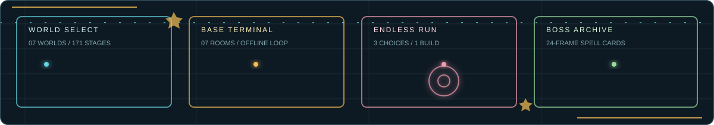

<div align="center">




**Godot 4.6** · **当前版本 v1.0.98** · **Windows / macOS / Web / Android** · **横屏 1600x900 基准布局**

[在线试玩](https://nightsreimu.github.io/pvz-godot/) · [下载最新版](https://github.com/NightsReimu/pvz-godot/releases/latest) · [版本历史](https://github.com/NightsReimu/pvz-godot/releases) · [提交问题](https://github.com/NightsReimu/pvz-godot/issues)

</div>

> [!WARNING]
> 这是仍在持续开发的非官方、非商业同人游戏。源码采用 MIT License，但媒体素材不属于 MIT 授权范围。仓库内含未确认再分发许可的东方原曲；准备公开发行、镜像或再分发时，请先取得授权或替换这些音乐。详见 [ASSETS_LICENSE.md](ASSETS_LICENSE.md)。

## 项目简介

《植物大战僵尸 SVG 版》是使用 Godot 4.6 制作的横屏塔防同人项目。它以经典的格子种植、阳光管理和波次防守为核心，加入多世界主线、每日资源关、无尽三选一强化、植物养成、基建生产、抽卡与图鉴等系统，并制作了红魔乡、妖妖梦主题的东方 Boss 支线。

这不是原版游戏的移植。关卡、植物、僵尸、Boss 技能、界面和运行逻辑由本项目重新实现，部分玩法和美术仍在迭代。当前数据规模约为：

| 内容 | 当前规模 |
| --- | ---: |
| 植物定义 | 135 |
| 僵尸与 Boss 定义 | 100 |
| 关卡定义 | 171 |
| 主世界 | 7 |
| 自动测试入口 | 75 |

数据会随开发变化，实际内容以当前 `main` 分支和最新 Release 为准。

## English Summary

This repository contains a fan-made lane-defense game built with Godot 4.6. It expands the classic plant-versus-zombie formula with seven adventure worlds, daily stages, endless run bonuses, plant enhancement, a base-management loop, a collection system, and Touhou-inspired boss branches.

The original source code is available under the MIT License. Bundled artwork, audio, fonts, character names, Touhou Project derivative content, and other media are **not** covered by MIT. Original Touhou music in this repository has no verified redistribution license; distributors must obtain permission or replace those tracks. This is an unofficial, noncommercial fan project and is not endorsed by the relevant rights holders.

## 视觉预览

<table>
<tr>
<td width="56%"></td>
<td width="22%"></td>
<td width="22%"></td>
</tr>
<tr>
<td colspan="3"></td>
</tr>
</table>

首屏的扫光、粒子和轨道动画由仓库内的 SVG 自托管，游戏内的植物、卡面和角色素材仍按各自管线维护。GitHub 禁用动画时，面板会保留静态线框、色块和完整的可读文本。

## 游戏内容

| 模式 | 玩法重点 | 当前状态 |
| --- | --- | --- |
| 主线关卡 | 世界地图、关卡解锁、选卡、传送带、Boss 战和特殊地形 | 可游玩，持续扩展 |
| 每日关卡 | 按星期开放的多个资源系列，每个系列包含分级关卡 | 可游玩 |
| 无尽模式 | 僵尸逐波成长，每波结束随机出现三个本局强化供玩家选择 | 可游玩 |
| 娱乐关卡 | 砸罐子、敲击等规则变化关卡 | 部分可游玩 |
| 活动关卡 | 独立于主线的阶段与特殊敌人池 | 持续扩展 |
| 植物强化 | 面向全部植物的属性培养、材料消耗和类型化加成 | 可游玩 |
| 基建模式 | 房间生产、植物进驻、心情、宿舍恢复、无人机加速和离线收益 | 可游玩 |
| 抽卡系统 | 普通/高级抽取、植物与能量豆资源、收藏展示 | 可游玩 |
| 图鉴 | 植物、普通僵尸、特殊僵尸和 Boss 的属性与机制说明 | 可游玩 |

### 七个主世界

| 世界 | 代表机制 |
| --- | --- |
| 白天庭院 | 阳光经济、基础阵型、保龄球与红魔馆 Boss 支线 |
| 夜幕庭院 | 无自然阳光、墓碑、蘑菇体系与妖妖梦 Boss 支线 |
| 泳池时代 | 六行战场、水路、睡莲、游泳和冰道单位 |
| 浓雾后院 | 动态视野、路灯、三叶草、防空和雾系植物 |
| 屋顶时代 | 斜坡弹道、花盆、投掷植物、风向与空袭 |
| 城市世界 | 轨道、井盖、霓虹街区、暴风雪与混编敌群 |
| 火山世界 | 高低地、岩浆喷发、投掷/追踪体系与火山 Boss |

### 战斗系统

- 5 行或 6 行棋盘，根据关卡地形切换陆地、水路、屋顶、城市、冰雪、云海等规则。
- 选卡界面显示当前关卡背景，并可打开大尺寸地形预览。
- 植物既有普通攻击，也支持点击大招和能量豆大招；不同植物拥有独立效果。
- 子弹、命中、爆炸、寒冰、电击、Boss 符卡和界面交互均带程序化特效与音效反馈。
- 无尽加成、永久强化和关卡临时机制彼此隔离，避免污染其他模式数值。
- 进度、货币、强化、基建和图鉴数据使用本地存档，并兼容旧字段补全。

<details>
<summary><strong>基建模式详情</strong></summary>

基建包含控制中枢、贸易站、制造站、发电站、宿舍、加工站和训练室。植物同一时间只能进驻一个房间，心情影响工作效率，宿舍负责恢复。贸易站产金币，制造站产强化材料，发电站产无人机，训练室产植物碎片，加工站负责定向转换；离线收益最多结算 8 小时。领取资源、无人机加速、植物进驻和房间生产均有独立终端风动效。

</details>

<details>
<summary><strong>无尽模式详情</strong></summary>

每波清场后暂停下一波倒计时，并从十余种本局强化中随机给出三个不重复选项。加成覆盖伤害、攻速、生命、冷却、阳光、能量豆、投手、范围效果、精英赏金和场面恢复等方向。选择结果只在当前无尽局生效，重新开始或退出后清空。

</details>

## 东方 Boss 支线

项目目前包含两组主要东方主题支线。Boss 技能参考角色设定和对应原作关卡的符卡主题重新设计，并适配植物防守玩法；不是对原作弹幕的逐帧复制。

### 红魔乡主题

白天世界的支线从血月庭院延伸到红魔馆，包括露米娅、大妖精、琪露诺、红美铃、小恶魔、帕秋莉、十六夜咲夜、蕾米莉亚和芙兰朵露。技能覆盖黑暗、冰晶、彩虹弹幕、元素魔法、飞刀与时停、红枪、吸血和禁忌破坏等机制。

### 妖妖梦主题

夜晚世界的 2-25 至 2-31 支线依次进入雪夜森林、迷途家、魔法森林、云海、旋转楼梯、西行妖樱花庭院和白玉楼境界。主要 Boss 包括蕾蒂、橙、爱丽丝、莉莉白、骚灵三姐妹、魂魄妖梦、西行寺幽幽子、八云蓝和八云紫；部分关卡设置琪露诺、妖梦或橙作为道中 Boss。

- 云海关卡的云格会从右向左漂移，缺云格不可种植，云散时植物会坠落。
- 妖梦以半灵、剑气、瞬步和怨灵魅惑构成近身压迫，但专属移动不会触发小推车。
- 幽幽子以墓碑、亡灵、樱花汇聚和一次复活构成双阶段战斗，复活后切换独立 BGM。
- 八云蓝倒下后由八云紫接替终幕，使用式神、境界与隙间主题技能。
- 东方 Boss 使用 24 帧姿势组动画管线，并带独立预热、朝向、白边清理和资源完整性测试。
- 东方符卡出处、Normal/Extra/Phantasm 路线、原创怨灵符卡及塔防适配边界见 [东方 Boss 符卡对照](docs/touhou-spells.md)。

> [!NOTE]
> 东方角色、名称、设定和 Boss 美术属于 Touhou Project 相关二次创作内容。仓库中的东方原曲仍受原权利人保护，不能因为代码开源就视为可自由复制或再分发。

## 操作方式

### 键盘与鼠标

| 操作 | 行为 |
| --- | --- |
| 鼠标左键 | 选择卡片、种植、收集资源、点击按钮；未选择工具时点击植物可发动点击大招 |
| 能量豆按钮 + 植物 | 对目标植物发动能量豆大招 |
| 铲子 + 植物 | 移除目标格最上层植物或支撑植物 |
| 鼠标右键 | 取消当前工具；战斗中向目标位置发射最近一台已充能的玉米加农炮 |
| 鼠标滚轮 | 翻阅世界、选卡池、图鉴、强化 roster、基建 roster 和抽卡记录 |
| `Esc` | 战斗中暂停/继续；从战斗图鉴返回战斗 |

### 触屏

- 单击等同鼠标左键，支持选卡、种植、资源领取和按钮操作。
- 横向拖动切换世界或移动地图，纵向拖动滚动卡池、图鉴和 roster。
- 移动端要求横屏；竖屏时会显示旋转提示。
- 小屏幕采用独立缩放和触摸命中区域，建议使用浏览器全屏或系统横屏模式。

## 下载与运行

### 在线试玩

直接打开 [GitHub Pages Web 版](https://nightsreimu.github.io/pvz-godot/)。首次加载需要下载游戏资源；浏览器可能要求先点击页面才能播放音频。WebGL 或音频策略异常时，优先使用桌面 Release。

### Release 安装包

前往 [最新版本页面](https://github.com/NightsReimu/pvz-godot/releases/latest)，每个正式版本包含以下产物：

| 平台 | 文件 | 运行方式 |
| --- | --- | --- |
| Windows | `pvz-godot-windows.zip` | 解压后运行 `pvz-godot.exe` |
| macOS | `pvz-godot-macos.zip` | 解压后打开 `.app`；未签名构建可能需要在“隐私与安全性”中手动允许 |
| Android | `pvz-godot-android.apk` | 允许从当前文件来源安装 APK，建议横屏运行 |
| Web | `pvz-godot-web.zip` | 解压后通过 HTTP 服务器托管，不要直接双击 `index.html` |

所有历史版本和构建资产统一保存在 [GitHub Releases](https://github.com/NightsReimu/pvz-godot/releases)。不要从来源不明的镜像安装。

> [!CAUTION]
> Release 包含的东方原曲没有经过本仓库可验证的再分发授权审核。该状态不影响阅读或修改 MIT 源码，但会影响媒体包的公开镜像、再发行和商业使用。分发者应先取得授权或替换音乐，并重新审查所有素材来源。

### 存档

Godot 会将进度写入当前用户的 `user://pvz_progress_save.json`。`user://` 的具体系统路径由 Godot 和平台决定。更新或测试前建议备份该文件；不要把个人存档提交到仓库。

## 本地开发

### 环境要求

- [Godot Engine 4.6 stable](https://godotengine.org/download/archive/4.6-stable/)，项目使用 GL Compatibility 渲染器。
- Git 和 Python 3；Python 只用于资源管线与仓库级测试。
- Android 导出额外需要 JDK 17、Android SDK Platform 35 和 Build Tools 35。
- 推荐 1600x900 或更大的横屏窗口进行界面验收，同时测试 1365x768 和移动横屏尺寸。

### 获取并运行

```bash
git clone https://github.com/NightsReimu/pvz-godot.git
cd pvz-godot
godot --editor --path .
```

在编辑器中运行 `res://scenes/main.tscn`，或者直接从命令行启动：

```bash
godot --path .
```

无窗口启动检查：

```bash
godot --headless --path . --quit
```

### 本地导出

安装 Godot 4.6 导出模板后，可使用仓库内 `export_presets.cfg`：

```bash
godot --headless --path . --export-release "Windows Desktop" build/releases/windows/pvz-godot.exe
godot --headless --path . --export-release "macOS" build/releases/macos/pvz-godot.app
godot --headless --path . --export-release "Web" build/releases/web/index.html
godot --headless --path . --export-release "Android" build/releases/android/pvz-godot.apk
```

Android 正式包还需要签名配置。不要把 keystore、密码或任何私钥提交到 Git。

## 项目结构

| 路径 | 作用 |
| --- | --- |
| `scenes/main.tscn` | 主场景入口 |
| `scripts/game.gd` | 当前主控制器、界面路由和大量战斗表现逻辑 |
| `scripts/data/` | 植物、僵尸、世界、关卡和图鉴文本定义 |
| `scripts/runtime/` | 植物、投射物、僵尸和目标等可拆分运行时逻辑 |
| `scripts/system/` | 窗口模式、自动更新等系统服务 |
| `scripts/tools/` | Image2 素材清单、Boss 帧处理和资源生成工具 |
| `art/` | UI、植物、僵尸、Boss 帧、字体和程序绘制覆盖素材 |
| `audio/` | BGM 与战斗音效；不属于 MIT 源码许可 |
| `tests/` | GDScript 无头测试和 Python 仓库契约测试 |
| `.github/workflows/release.yml` | 四平台构建、GitHub Release 与 Pages 部署 |
| `docs/plans/` | 重要功能的设计和实施记录 |

当前 `scripts/game.gd` 仍然较大。新增逻辑应优先进入已有的 `data`、`runtime`、`system` 边界，只有需要访问统一绘制或共享模式状态时才继续放在主控制器中。

## 测试

GDScript 测试是可直接执行的无头脚本，成功时退出码为 0。例如：

```bash
godot --headless --path . -s res://tests/game_boot_test.gd
godot --headless --path . -s res://tests/world_navigation_test.gd
godot --headless --path . -s res://tests/special_modes_test.gd
godot --headless --path . -s res://tests/touhou_boss_animation_frames_test.gd
godot --headless --path . -s res://tests/touhou_spell_contract_test.gd
godot --headless --path . -s res://tests/yakumo_branch_test.gd
```

仓库和资源管线检查：

```bash
python3 tests/readme_quality_test.py
python3 tests/release_workflow_test.py
python3 tests/image2_asset_manifest_test.py
python3 tests/touhou_boss_animation_pipeline_test.py
git diff --check
```

修改范围决定回归范围：界面改动至少运行对应布局/触摸测试，植物或僵尸改动至少运行其行为测试和 `game_boot_test.gd`，发布配置改动必须运行 `release_workflow_test.py`。合并前请在桌面和移动横屏尺寸各做一次人工视觉检查。

## 参与贡献

1. 从 `main` 创建短生命周期分支，例如 `feat/daily-stage` 或 `fix/selection-touch`。
2. 先写能复现需求或缺陷的测试，再实现最小改动。
3. 遵循现有 GDScript 缩进、typed helper 和数据定义风格，不顺手改写无关模块。
4. 运行与改动相关的测试、`game_boot_test.gd` 和 `git diff --check`。
5. Pull Request 说明行为变化、验证命令、截图或录屏，以及新增素材的来源和授权。

提交信息建议使用 Conventional Commits：

```text
feat: add a new stage mechanic
fix: prevent selection touch fallthrough
balance: tune boss pressure
docs: clarify asset licensing
```

### 素材贡献要求

- 每个新增图片、音频、字体或角色素材都必须说明作者、来源、生成方式和可再分发许可。
- 不接受“从网上找到”作为授权证明，也不要提交带水印、署名不明或许可冲突的素材。
- Image2 生成素材必须保留生成配置和后处理步骤，并人工检查角色一致性、透明边缘和第三方标识。
- 东方二创内容还应遵守 [Touhou Project Fan Creator Guidelines](https://touhou-project.news/guidelines_en/)；这些规则不会自动赋予东方原曲的复制或再分发许可。
- 发现权利问题时，请通过 [Issue](https://github.com/NightsReimu/pvz-godot/issues) 提供文件路径和权利依据，维护者会优先下架或替换争议内容。

## 路线图

- 审计并记录全部媒体素材来源，优先替换没有明确再分发许可的东方原曲。
- 继续把 `scripts/game.gd` 的战斗、Boss、界面和存档职责拆分到独立模块。
- 补齐活动关卡、娱乐关卡和每日系列的内容密度与奖励平衡。
- 完善移动端性能、触摸可达性、低分辨率布局和 Web 首屏加载。
- 为 Boss 技能、植物双大招、特殊地形和存档迁移增加更完整的回归测试。
- 逐步补充第三方素材清单、贡献指南和正式公开发布所需的合规文件。

### 已知限制

- 项目体量和媒体资源较大，Web 首次加载与移动端内存占用仍需优化。
- 部分平台包未经商业代码签名，系统可能显示安全提示。
- 当前美术混合程序绘制、SVG、Image2 生成图和二创 Boss 帧，风格一致性仍在整理。
- 东方原曲的再分发授权未完成核验；这是公开镜像和正式发行前必须解决的问题。
- 本项目仍处于开发阶段，存档 schema、平衡和界面可能在版本间调整。

## 许可与素材声明

- [LICENSE](LICENSE)：仅适用于本项目原创源代码的 MIT License。
- [ASSETS_LICENSE.md](ASSETS_LICENSE.md)：图片、音频、字体、角色、名称、第三方 IP 和二次创作素材的独立声明。
- 媒体素材不属于 MIT 授权范围；克隆仓库不代表获得这些素材的再许可权。
- 东方 Boss 美术是基于 Touhou Project 的二次创作，需遵守官方二创规则及具体素材作者的要求。
- 东方原曲没有经过本仓库可验证的再分发授权审核；任何公开发行、镜像或衍生发布都应先取得授权或替换音乐。

Plants vs. Zombies 相关名称、角色与概念的权利归其各自权利人；Touhou Project 相关名称、角色、音乐与设定的权利归上海爱丽丝幻乐团及相关权利人。本项目与上述权利人无隶属、授权或背书关系。

---

<div align="center">

项目主页：[`NightsReimu/pvz-godot`](https://github.com/NightsReimu/pvz-godot)

</div>
