<div align="center">


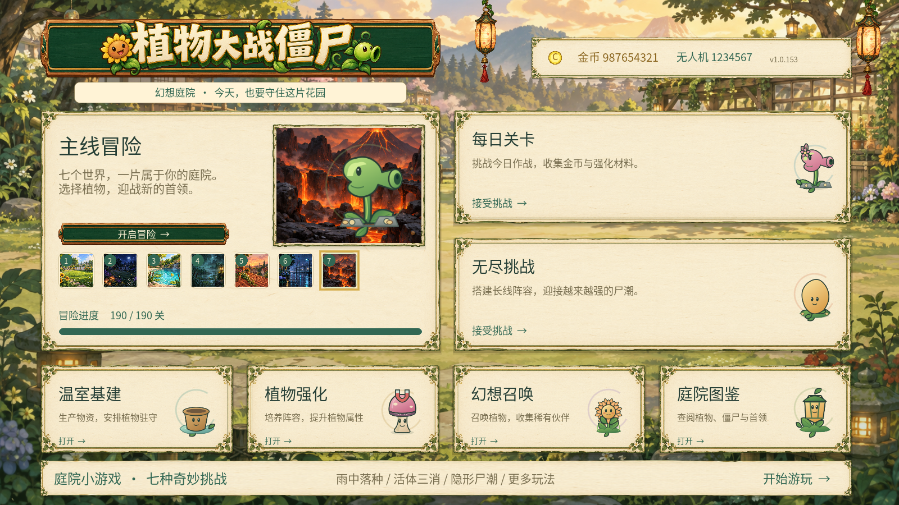

**Godot 4.6** · **当前版本 v1.0.177** · **Windows / macOS / Web / Android** · **横屏 1600x900 基准布局**

[在线试玩](https://nightsreimu.github.io/pvz-godot/) · [下载最新版](https://github.com/NightsReimu/pvz-godot/releases/latest) · [版本历史](https://github.com/NightsReimu/pvz-godot/releases) · [提交问题](https://github.com/NightsReimu/pvz-godot/issues)

</div>

> [!WARNING]
> 这是仍在持续开发的非官方、非商业同人游戏。源码采用 MIT License，但媒体素材不属于 MIT 授权范围。仓库内含未确认再分发许可的东方原曲；准备公开发行、镜像或再分发时，请先取得授权或替换这些音乐。详见 [ASSETS_LICENSE.md](ASSETS_LICENSE.md)。

## 项目简介

《植物大战僵尸 SVG 版》是使用 Godot 4.6 制作的横屏塔防同人项目。它以经典的格子种植、阳光管理和波次防守为核心，加入多世界主线、每日资源关、无尽三选一强化、植物养成、基建生产、抽卡与图鉴等系统，并制作了红魔乡、妖妖梦、永夜抄、萃梦想与风神录主题的东方 Boss 支线。

这不是原版游戏的移植。关卡、植物、僵尸、Boss 技能、界面和运行逻辑由本项目重新实现，部分玩法和美术仍在迭代。当前数据规模约为：

| 内容 | 当前规模 |
| --- | ---: |
| 可选原种植物 | 150 |
| 独立融合植物 SVG | 11,219 |
| 可融合材料两两配方（排除花盆、睡莲与保龄球专用坚果） | 11,026 |
| 僵尸与 Boss 定义（含 297 种融合） | 439 |
| 关卡定义 | 199 |
| 主世界 | 8 |
| 自动测试入口 | 163 |

数据会随开发变化，实际内容以当前 `main` 分支和最新 Release 为准。

**v1.0.140 投手朝向修正**：卷心菜投手、玉米投手、西瓜投手、天窗瓜炮、龙泡泡投手、喷气冬瓜与剧毒口香糖投手的脸朝向右侧，投臂位于左后方；选卡、图鉴、种植预览和实战同步修正，并保留 v1.0.139 的图鉴数值与大招说明。[版本说明](docs/releases/v1.0.140.md)。

**v1.0.141 植物独立 SVG 形态更新**：重建全部 144 种植物及状态变体的生成资源，为不同植物加入独立的根系、水面、菌丝、果托、炮台、支架、裂纹和元素轮廓；同类植物继续保持家族风格，但不再只靠换色区分。向量资源回归现在会检查每个主 SVG 的唯一签名和采样轮廓。[版本说明](docs/releases/v1.0.141.md)。

**v1.0.142 经典植物形态修正**：修正坟墓吞噬者的绿色低矮捕墓轮廓、魅惑菇的紫色催眠旋纹、双发射手的双头结构、金盏花的橙金花瓣，并补正南瓜和海蘑菇的经典造型；新增经典植物契约测试，防止这些外形和配色回退。[版本说明](docs/releases/v1.0.142.md)。

**v1.0.143 永夜抄动态地形种植修正**：水格、屋顶格和岩浆格在已有普通植物时可以补种对应底座；花盆可以直接种在普通草地。木塞子封堵岩浆后保持 3 秒，随后以抬升、摇摆、缩小和淡出的动画退场，只移除底座并保留已封堵的火山岩与植物。[版本说明](docs/releases/v1.0.143.md)。

**v1.0.144 战斗弹丸与特效 SVG 美化**：新增独立创作的 32 种弹丸与 76 种特效 SVG，保留动态拖尾、碰撞和程序化兜底，并使用缓存降低密集弹幕下的重复加载。[版本说明](docs/releases/v1.0.144.md)。

**v1.0.145 魅惑僵尸朝向与弹丸风格回退**：魅惑后的僵尸整体镜像并面向右侧移动；弹丸恢复此前的程序化渲染，保留特效 SVG 与缓存加载。[版本说明](docs/releases/v1.0.145.md)。

**v1.0.146 非东方关卡困难模式**：普通通关后解锁困难，困难模式将普通僵尸事件和波数提升至至少两倍，并混入额外敌人；东方关卡继续使用原有四档难度。[版本说明](docs/releases/v1.0.146.md)。

**v1.0.147 困难模式分关卡设计**：按白天、夜晚、泳池、浓雾、屋顶、城市和火山世界分别设计困难敌群，每个关卡阶段使用不同的强化僵尸组合、加入节奏差异和后期波次压力，不再所有关卡共用同一套敌人逻辑。[版本说明](docs/releases/v1.0.147.md)。

**v1.0.148 困难配置绑定具体关卡**：困难方案现在记录完整关卡 ID，编号关卡与 S 分支关卡分别选择强化敌人、插入节奏和波次压力，避免不同关卡落入同一套设计。[版本说明](docs/releases/v1.0.148.md)。

**v1.0.149 难度弹窗返回按钮修复**：修复非东方关卡难度选择弹窗中“返回地图”按钮无法响应鼠标和触屏释放事件的问题。[版本说明](docs/releases/v1.0.149.md)。

**v1.0.150 治愈葫芦回血提升**：治愈葫芦普通状态下每 3 秒为周围 3×3 植物恢复 120 生命，提升持续作战能力；保留只回血的职责、东方关卡中的回血抑制、大招行为与传送带出现权重。[版本说明](docs/releases/v1.0.150.md)。

**v1.0.151 红魔乡 Boss 素材更新**：露米娅、大妖精、琪露诺、红美玲、小恶魔、帕秋莉、十六夜咲夜、蕾米莉亚与芙兰朵露换用新提供的素材。逐个姿态分离人物和完整特效，单独保存 216 个运行帧，修正相邻蝴蝶、新月与飞刀弧线的归属；重新对应技能与受击动作，并统一人物高度和脚部锚点。[版本说明](docs/releases/v1.0.151.md)。

**v1.0.153 幻想庭院界面更新**：主页面改为手绘庭院告示板，世界选择改为七个目的地的旅行手册；纸张、雕刻木牌、标题与灯笼使用新生成插画。加入平滑悬停、按压、分批入场、灯笼摆动、落叶与萤火、世界插画渐变，以及功能页、选卡、暂停、难度与结果窗口的材质优化。[版本说明](docs/releases/v1.0.153.md)。

**v1.0.154 妖妖梦 Boss 素材更新**：蕾蒂、橙、爱丽丝、莉莉霍瓦特、魂魄妖梦、西行寺幽幽子、八云蓝与八云紫换用新提供的素材；按人物和完整特效逐个分离，单独保存 192 帧，保留人偶、半灵、九尾、翅膀和原始透明光效。重新对应待机、移动、施法与受击动作，统一人物高度和脚部锚点。[版本说明](docs/releases/v1.0.154.md)。

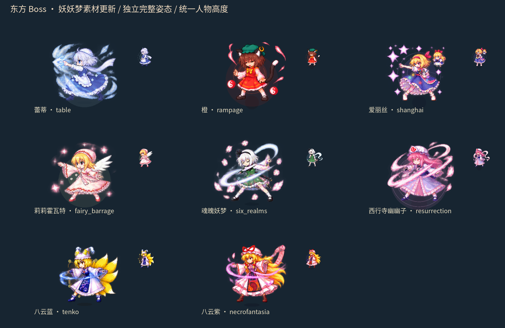

**v1.0.177 玄武之泽的河童 · 东方 4-21**：新增《风神录》三面关卡，六行旱地玄武岩岸台，雨中瀑布、河童水车与黄瓜藤。道中河城荷取先在光学迷彩中隐身偷袭，再宣告光学「光学迷彩」/「水迷彩」；终末按难度展开洪水、水符、河童三组原作符卡（泥浆泛滥/冲积梦魇/漂溺、河口浪潮/山洪暴发/幻想大瀑布、妖怪黄瓜/延展手臂/回转顶板），E/N/H/L 共 6/7/8/9 阶段。原创迷彩突击队（路灯花照出）、可打碎返阳光的黄瓜诱饵（被僵尸吃掉会回血）、浇灭火炬树桩的高压水炮（叶子保护伞庇护、大招清除积水）与工房总动员针对本作阵型；敌群以融合护甲毛玉、精灵和雨伞、扶梯、小丑盒僵尸为主。接入用户提供的 24 帧像素风素材与道中、终末 BGM。[版本说明](docs/releases/v1.0.177.md) · [设计与原作对照](docs/plans/2026-10-06-nitori-4-21.md) · [素材来源](docs/nitori-assets.md)。

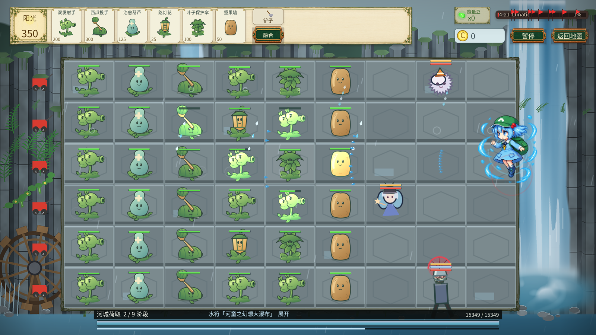

**v1.0.176 风神录终末弹幕强化**：4-19 秋穰子与 4-20 键山雏完整终末的实际发弹量约为 v175 的 2.05–2.31 倍；催熟、贡仓和厄印等原本稀疏的机制卡加入交替三行齐射，旋轮、火弹与人偶保留各自轨迹。修复横屏六行棋盘中弹幕受格子高度拖慢、到达中后场前消失的问题，保持预警、镜返、时停及大招反制。符卡数量、生命、单发伤害、传送带与增援节奏沿用 v175，道中保持弱化。[版本说明](docs/releases/v1.0.176.md)。

**v1.0.175 传送带与东方终末平衡**：4-19、4-20 传送带改为每2.8–4.0秒发牌；满带暂停补牌计时，保留开场三张。东方终末生命较v174增加约34.5%，完整角色新增2张原创阶段，最短路线新增3张；原作符卡与末牌、复活流程保留，道中保持弱化。4-19、4-20、8-6终末登场1.8秒后开始多行增援，E/N每批2只、H/L每批3只，后期含更多护甲与融合敌人，敌方及待入场数量上限42。当前秋穰子5/6/7/8、雏6/7/8/9、萃香9/10/11/12阶段。[版本说明](docs/releases/v1.0.175.md)。

**v1.0.174 山麓厄神之路**：新增 4-20《风神录》二面关卡，六行旱地山林坡地、土石梯田种植格。键山雏道中短暂隐现后宣告弱化符卡，终末沿用东方分段血条，E/N/H/L 分别有4/5/6/7个符卡阶段。原作护符、厄运之轮与流放人偶之外，逐级加入迟发厄印、可击破的厄运人偶、每第三发失准与流雏厄祭；普通和融合植物同样受影响，大招净化本行。毛玉与星弹精灵持续增援，新增8种护甲融合变体并保留分裂、预警攻击与可破护甲。接入用户24动作素材和独立道中、终末BGM，修复通用精灵预警与多行大招弹源判定。[版本说明](docs/releases/v1.0.174.md)。

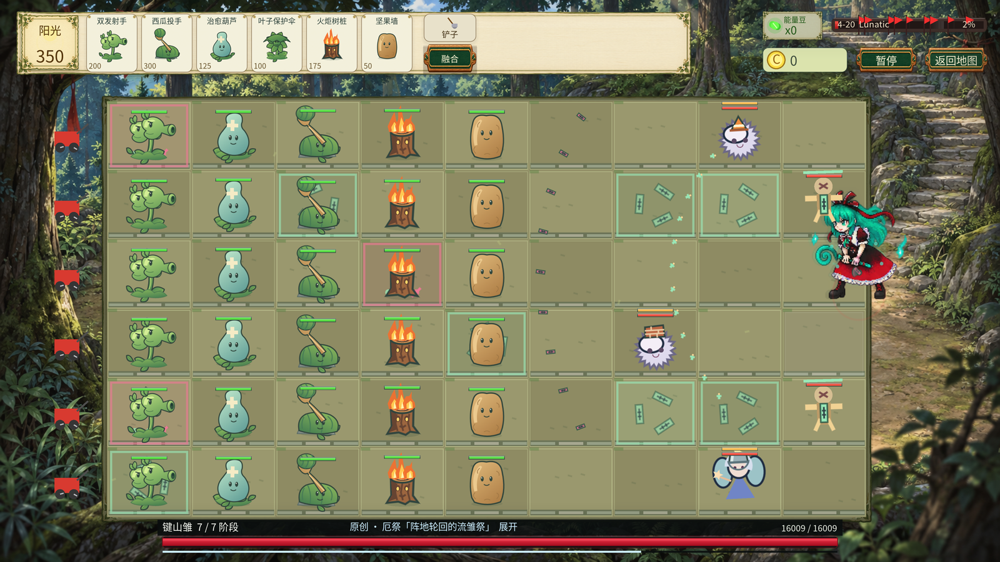

**v1.0.173 僵尸与东方 Boss 增强、融合大招起手重击**：所有非 Boss 僵尸生命 ×1.25、啃食 ×1.8、移速 ×1.08；第二世界起，每波有 10%–25% 的僵尸带着融合装备登场。新增砖块与武士盔，融合僵尸增至 289 种，并与融合植物一样移出图鉴。东方 Boss 弹幕伤害提高 17%–36%，出招更快、弹幕更密，多数难度生命更高。融合大招新增起手重击，伤害约为 7 秒持续火力，范围随招式；300 种融合抽样中，大招 3 秒内额外伤害的中位数从约 400 提高到约 1500。[版本说明](docs/releases/v1.0.173.md)。

**v1.0.172 红枫与丰穰 · 东方 4-19**：六行无水红枫旱地，秋静叶道中、秋穰子终末，使用提供的24帧角色素材与两首独立BGM。保留《风神录》一面原作难度符卡，终末3/4/5/6阶段；原创催熟田垄、可击破返阳光的贡仓与红叶毯，覆盖原生、融合和支援植物，能量豆清本行。E/N/H输送，L自选卡。[版本说明](docs/releases/v1.0.172.md) · [设计与原作对照](docs/plans/2026-10-05-aki-4-19.md) · [素材来源](docs/aki-assets.md)。

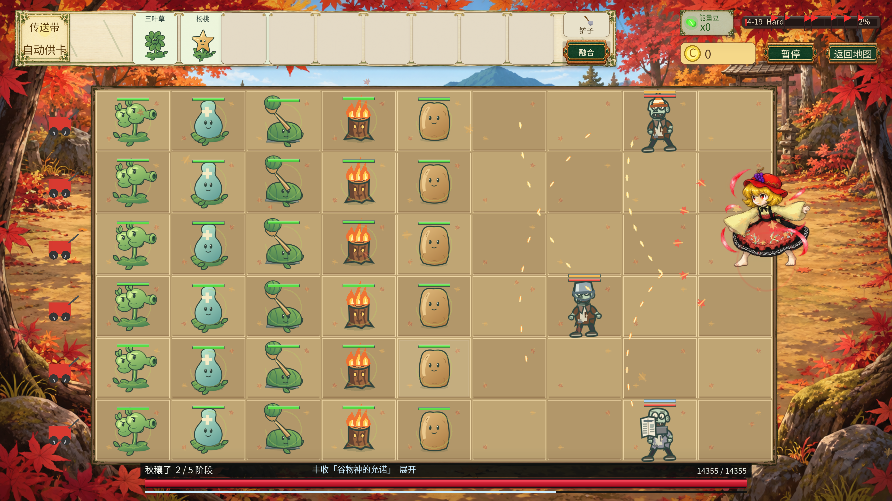

**v1.0.171 融合招牌大招与特效整理**：融合大招不再同时释放一串通用技能，改为主攻手法加搭档灌注的单一招牌技，例如「樱爆齐射」「坚壳爆田」「炬火齐射」；命名配方恢复「汽化爆流」等专属名。灌注范围随招式而定，射手作用于前方三行、投手作用于前方全场、近身招式作用于周围3格，吞噬与领域补上实际效果。大招光束扫满整行，陨落爆炸画在落点，原种大招的大圆特效改为冲击波光环，东方符卡宣言改为不遮挡第一行植物的右上角标签。[版本说明](docs/releases/v1.0.171.md)。

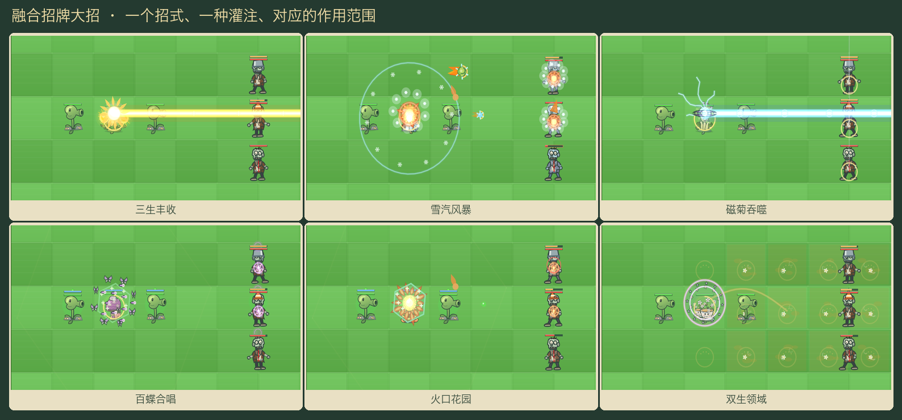

**v1.0.170 东方战斗与灰烬弹头平衡**：统一降低所有东方道中血量，终末血量提高 45%，覆盖 24 条路线与 90 个难度组合，并补齐八云蓝换八云紫的血量缩放。樱桃与射手融合改为小范围爆炸子弹，辣椒附加灼烧，毁灭菇附加暗爆；纯爆炸融合减伤，保留独立蓄力。[版本说明](docs/releases/v1.0.170.md)。


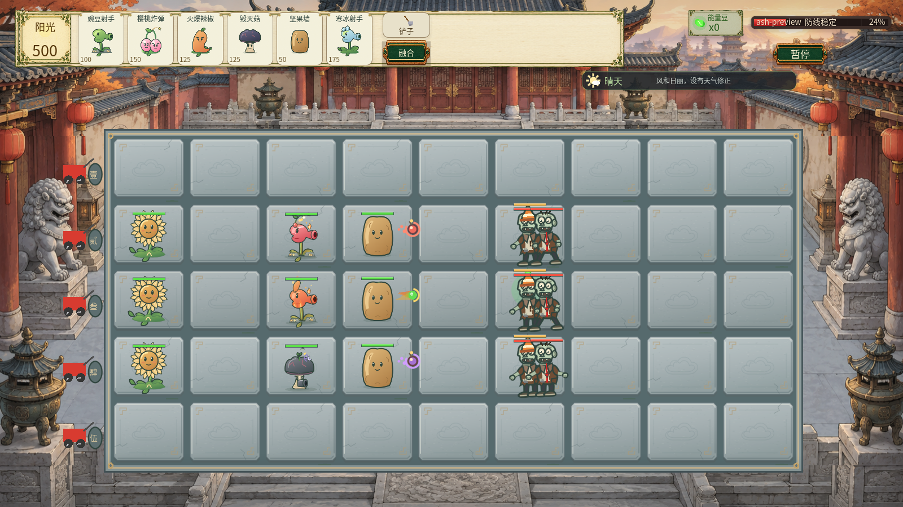

**v1.0.169 发布版音乐兼容**：修复导出包只保留 Godot 导入音频时的背景音乐加载，继续循环播放并共用缓存。再次核对四档道中使用原有夜晚音乐，只有满血终末萃香登场才切换用户提供的终末 BGM。[版本说明](docs/releases/v1.0.169.md)。

**v1.0.168 伊吹萃香终末酒宴**：新增古代世界 8-6 东方关卡，E/N/H 传送带、L 自选卡。弱化萃香道中后，终末以满血登场，沿用东方 Boss 分阶段血条、符卡宣言与进度；六张《东方萃梦想》故事符卡直到「百万鬼夜行」，并随难度累积四张明确标注的原创符卡。巨型伊吹瓢倾倒酒河、萃豆酒仓聚豆反击、方圆三角分酒席与百鬼疎宴融入塔防；茶与牛奶能护住附近植物，大招清掉本行酒液。酒河影响普通、融合与底层植物，Boss 战持续有僵尸增援。接入用户提供的24姿态透明素材与终末 BGM。[版本说明](docs/releases/v1.0.168.md)。

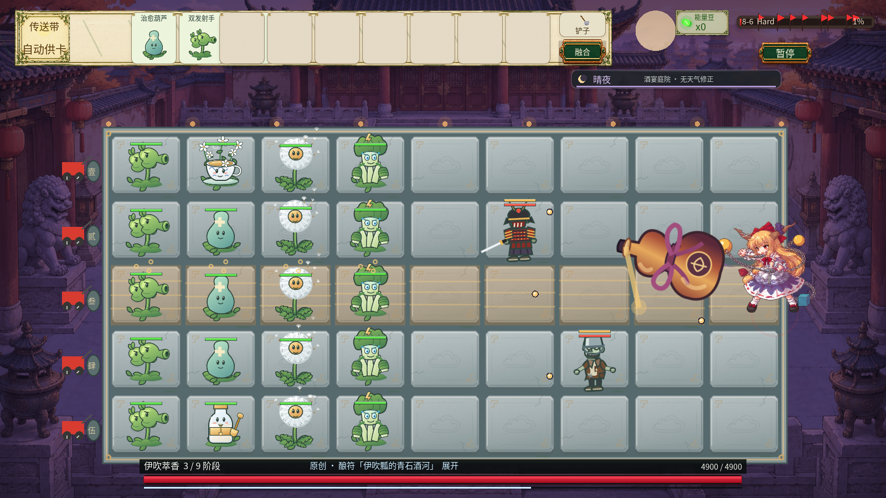

**v1.0.167 东方古城庭院与青石棋盘**：第八世界重制为红柱瓦殿、灰砖宫墙、石狮、铜灯与雕刻石阶围绕的古城庭院；45格全部改成云纹青石种植台，带石材纹理、倒角、裂纹与苔痕接缝。专用建筑带让场景在实战中可见，桌面与手机分别适配；雨天石台变湿并泛起水纹，雪天沿石台边缘积雪，世界封面和选卡预览同步更新。[版本说明](docs/releases/v1.0.167.md)。

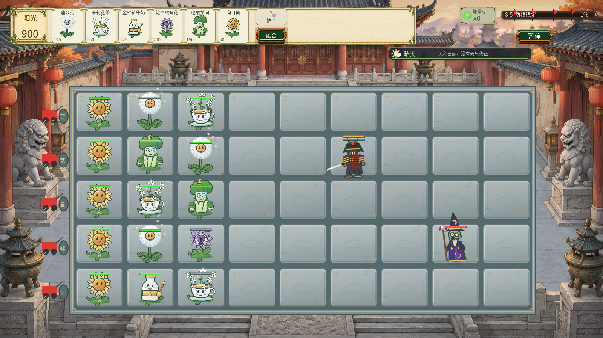

**v1.0.166 小推车气球拦截修复**：飞行中的气球僵尸抵达房子边界时会正常启动本行小推车，并由小推车清除；小推车正在运行时不会提前判负，用尽后仍按正常规则判负，挑战目标也会记录此次启动。[版本说明](docs/releases/v1.0.166.md)。

**v1.0.165 融合新物种造型与灰烬对空**：全部 11,219 个融合 SVG 改为“一株新植物”的画法。武器最鲜明的材料提供体型，颜色最鲜明的搭档为全身换上自己的材质，并铺上樱桃光泽、坚果裂纹、冰晶、熔岩、条纹、玉米粒或旋纹等纹理；没有武器的身体从嘴部长出搭档炮管，已有炮口的射手改装炮口；搭档还带来怒眉、霜眉、睡眼、螺旋眼等表情，以及元素徽记和战场循环特效。樱桃、辣椒、毁灭菇等灰烬材料融合后，爆舱与爆破类大招重新能命中气球等空中敌人。[版本说明](docs/releases/v1.0.165.md)。

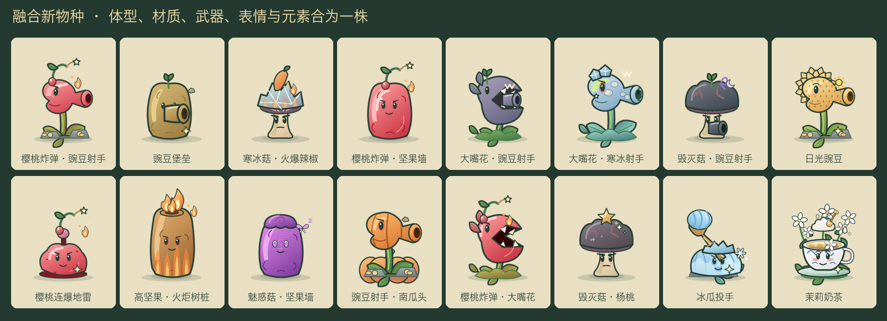

**v1.0.164 古代庭院与天气融合改进**：古代战场重做山景、云层、寺院边框、石径与草地纹理，新增飘雪、冰雹、沙尘和虹光，共十种天气。天气按原种、融合材料及子弹载荷判断冰火雷属性，影响普通植物与僵尸；雨中小游戏也接入细雨与雷暴。修复小游戏融合入口，落种可叠种融合，整列卡可融合已有植物；融合星星果、路灯和攻击植物继续满足关卡目标，传送门核心保持保护。新增茶蚀与奶浪子弹载荷，补齐电眼菜问等材料的雷电弹药，近战与光束大招补上后续齐射，蒲公英与菜问保留原种大招。[版本说明](docs/releases/v1.0.164.md)。

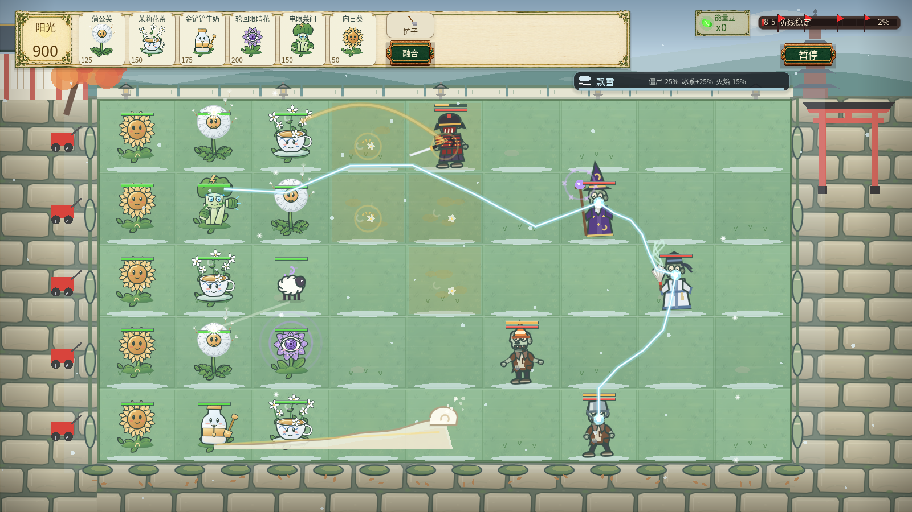

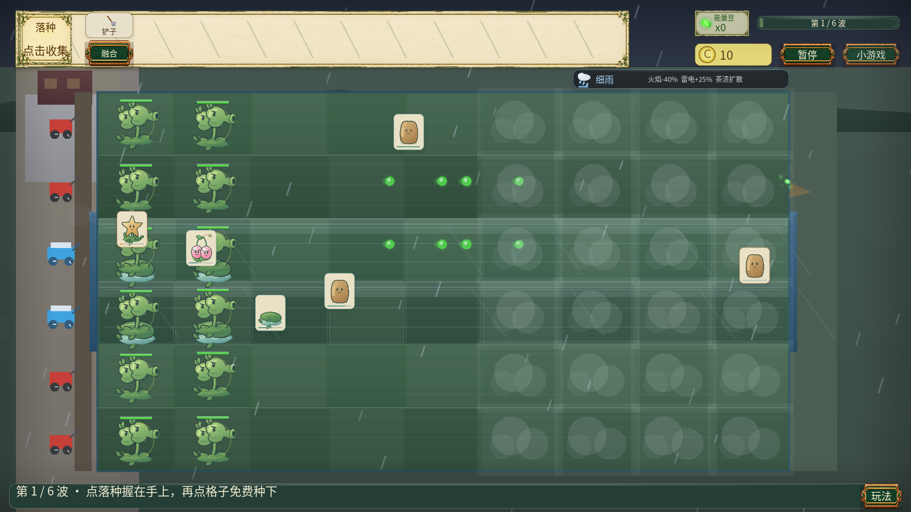

**v1.0.163 古代世界、天气系统与融合造型重做**：新增第八世界「古代世界」8-1 ~ 8-5，每关一株新植物——蒲公英、茉莉花茶、金铲铲牛奶、轮回眼睛花、电眼菜问；古代武士、古代法师与军师僵尸登场。天气系统按关卡轮换晴天、烈日、细雨、雷暴、东风与大雾，分别影响阳光、火焰与雷电伤害、僵尸移速、直射视野和新植物特性，军师还会挥扇改写天气。全部 11,219 个融合 SVG 改用基础植物的画法：最适合的材料提供完整本体，其余材料长出豌豆炮口、花瓣光环、菌盖、坚果护甲、投石臂、莲座等标志部件；融合大招与爆舱特效全部重绘。融合本体不再按字母顺序落在地刺、海草或一次性植物上，保龄球专用坚果退出融合。[版本说明](docs/releases/v1.0.163.md)。

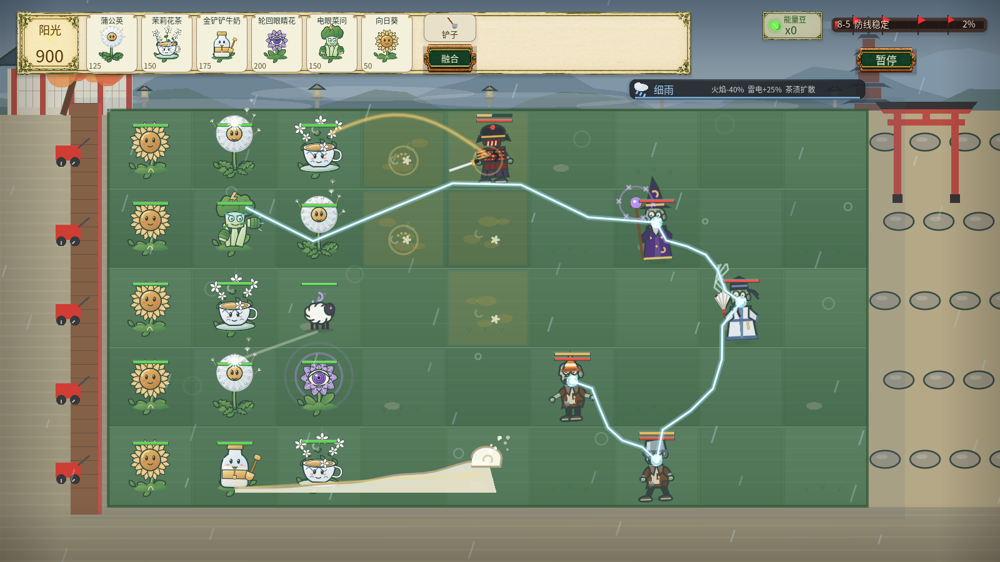

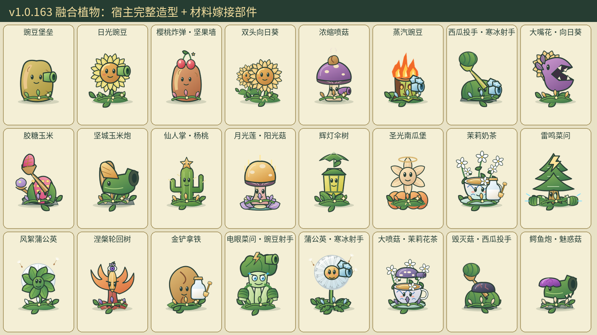

**v1.0.162 原生融合与组合弹药**：融合材料分别调用原植物的攻击与支援逻辑，保留投掷、月炉追踪、莲矛环射、提灯对空、镜芦苇反弹及加农炮手动瞄准。投掷弹根据原目标移动更新落点；递归融合保留装填和蓄力状态。新增烈焰玉米、烈焰黄油及冰霜、毒蚀、雷电、梦蝶、缠根组合载荷，分裂子弹继续继承属性；魔术花覆盖 40 种基础弹型与元素组合，共 2,560 个登记变体。花盆和睡莲只作底座，启动大招恢复满生命。[版本说明](docs/releases/v1.0.162.md)。

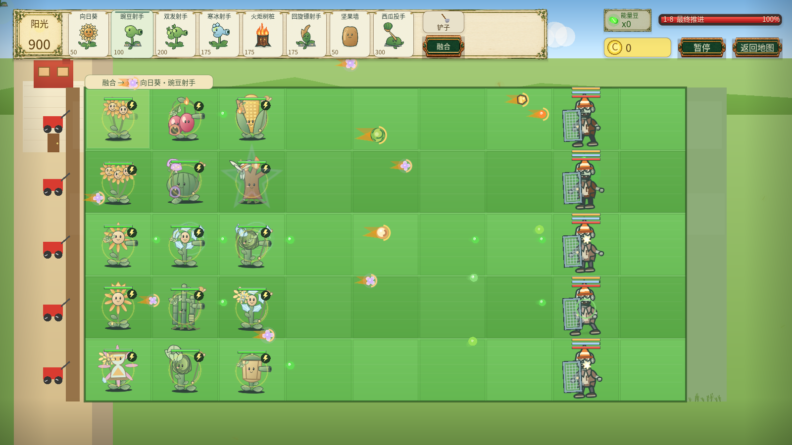

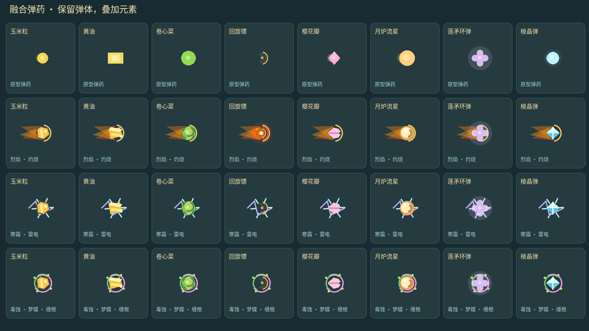

**v1.0.161 融合植物造型重做**：植物图鉴只展示可收集原植物，融合配方和继续共生的植物均不占图鉴条目。重做全部 10,921 个固定融合 SVG，以材料决定主体轮廓、根系、配色和攻击部件：坚果堡垒、樱桃双果、菌伞、镜晶花、竹节塔、瓜炮、玉米穗、玻璃瓜、藤蔓与莲台等分别生长；后续共生模型使用相同规则实时生成。取消共用的绿色底座与闲置环绕光圈，保留朝向、独立武器、大招和原材料特殊能力。[版本说明](docs/releases/v1.0.161.md)。

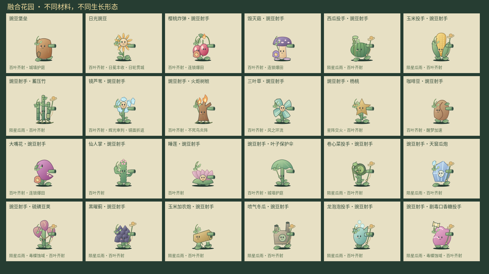

**v1.0.160 融合特性与战斗重构**：每种材料的武器分别保留伤害、装填时间、射程和弹道；灰烬类材料改为独立蓄力爆舱，樱桃与毁灭菇保留圆形范围爆炸，火爆辣椒保留整行火焰，爆炸伤害不再叠进连发子弹。投手继续抛射，重炮保留长周期装填；镜芦苇融合后继续反弹狙击与 Boss 弹幕，并加入镜盾大招。补回蓄压存弹、黄油冻结、易伤、分裂、荧光爆发、冰晶脉冲、寒霜累计冻结与复生等特性。优化独立 SVG 的投掷臂、爆舱、镜面瓣和装填动画，图鉴逐项显示各武器伤害与周期。[版本说明](docs/releases/v1.0.160.md)。

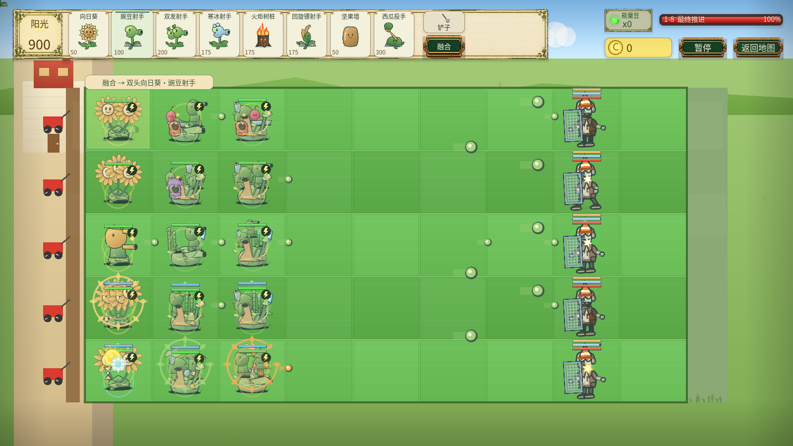

**v1.0.159 全植物融合与共生大招**：任意两种原植物、融合植物与原植物、两株融合植物均能合成，并可继续融合。保留双头向日葵、双发与机枪等经典配方；其余组合按材料继承攻击、元素和支援技能。10,921 个形态分别拥有独立 SVG 文件，后续共生形态实时生成独立模型。重做 31 类大招及其组合效果：三轮齐射、冰火汽爆、陨星瓜雨、往返刀刃、磁轨雷束、幽灵游行、梦蝶魅惑、治疗护盾和醒梦加速等；图鉴逐项说明实际效果。修复被动底座吞掉攻击、白天混合蘑菇睡眠、南瓜融合消失及数种大招只有动画的问题。[版本说明](docs/releases/v1.0.159.md)。

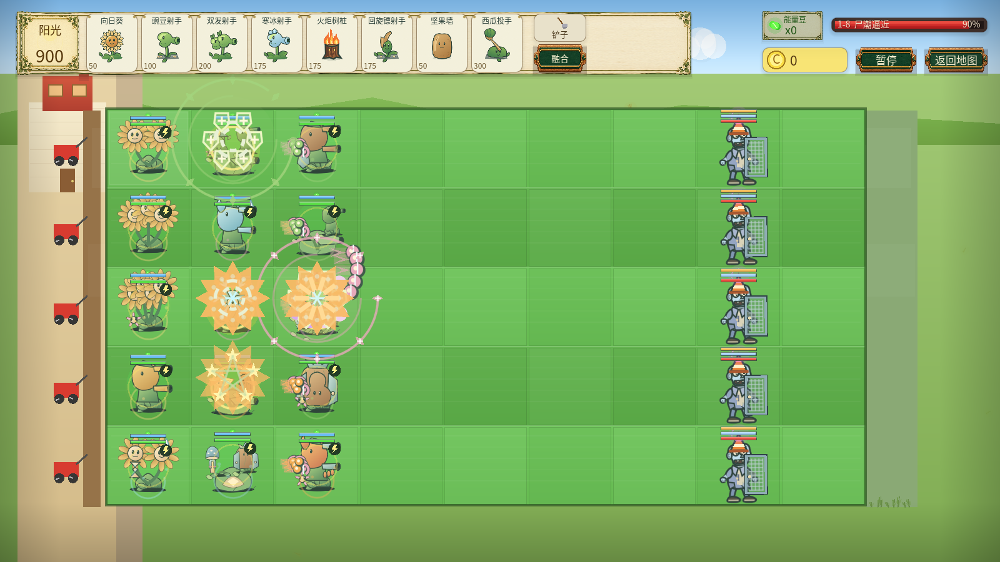

**v1.0.157 融合僵尸与保龄球阵营修复**：新增 163 种装备融合组合，保留原型技能；头戴护具使用橙金血条，手持护具使用蓝色血条，喷雾、回旋镖和穿透光束仍需击破头戴护具。融合组合从无尽第 6 波起按强度逐步加入。修复普通、强化坚果与芒果保龄球攻击魅惑僵尸的问题，友军不再触发碰撞、溅射或消耗弹跳次数。[版本说明](docs/releases/v1.0.157.md)。

**v1.0.156 骚灵三重奏与东方施法特效**：三姐妹同时现身并共享血量，替换为 72 张独立姿态；补全三人独奏、合奏与四难度符卡，修正植物和投射物对三人的索敌。新增 21 张透明技能插画，29 种东方 Boss 均有施法表现，三姐妹各有乐器共鸣特效。[版本说明](docs/releases/v1.0.156.md)。

**v1.0.155 东方符卡插画特效**：新增六组透明特效插画：封印法阵、星光蓄力、冰晶、樱花灵光、凤凰火焰与隙间；接入十位东方 Boss 的符卡蓄力、展开、持续施法与消散。灵梦封印格、魔理沙光符格和激光蓄力、妹红灼烧格、紫的阶段隙间与幽幽子复活灵光同步使用对应素材；特效随原技能计时播放，并在植物、弹幕和预警下方绘制。[版本说明](docs/releases/v1.0.155.md)。

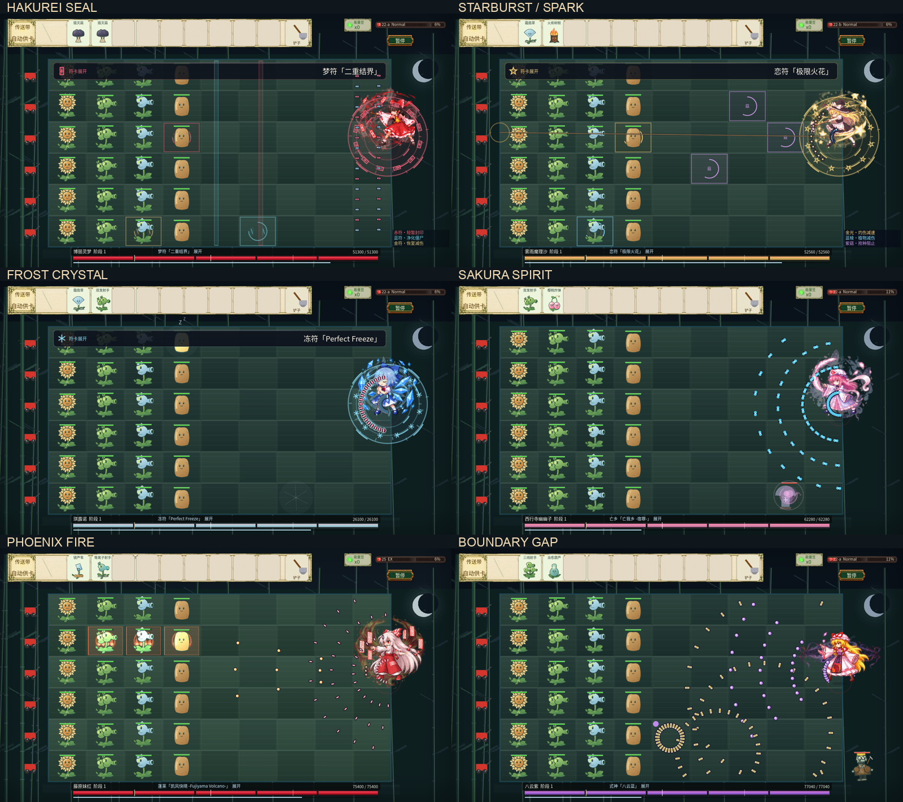

**v1.0.138 单位美术与战斗细节更新**：逐项复查全部 146 种植物和 129 种僵尸/Boss，为 144 种植物重绘可编辑 SVG，保留火炬树桩实时火焰与坚果保龄球的派生造型；更新僵尸五官、身体、装备破损和落地阴影。修复魔术花特殊子弹、方形攻击范围及特殊僵尸的绘制偏移。新增 3-25「蓬莱人形」EX / EX+，半兽慧音道中与妹红终末。详见 [完整版本说明](docs/releases/v1.0.138.md)。

## English Summary

This repository contains a fan-made lane-defense game built with Godot 4.6. It expands the classic plant-versus-zombie formula with eight adventure worlds (the newest adds a weather system), daily stages, endless run bonuses, plant enhancement, a base-management loop, a collection system, and Touhou-inspired boss branches.

The original source code is available under the MIT License. Bundled artwork, audio, fonts, character names, Touhou Project derivative content, and other media are **not** covered by MIT. Original Touhou music in this repository has no verified redistribution license; distributors must obtain permission or replace those tracks. This is an unofficial, noncommercial fan project and is not endorsed by the relevant rights holders.

## 视觉预览

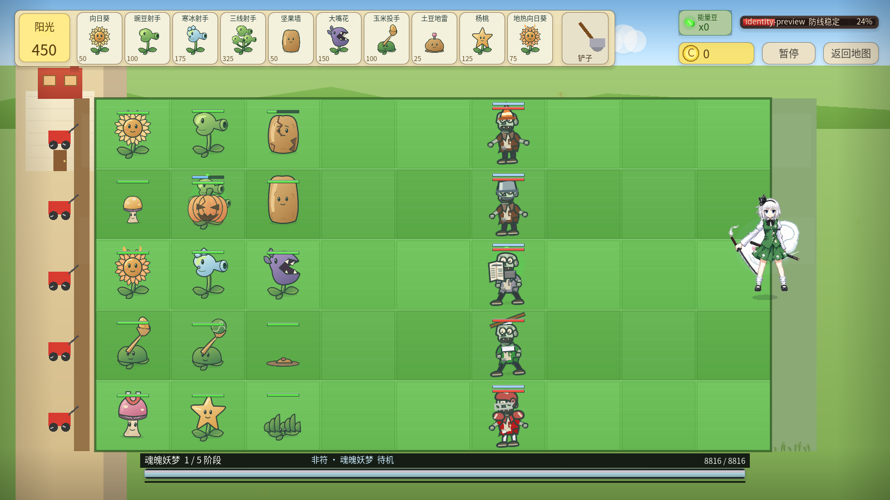

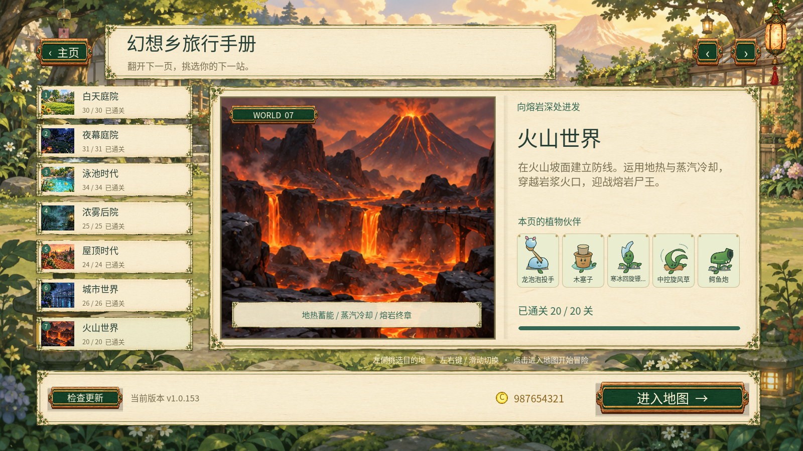

主页面与世界手册采用手绘庭院、纸张和雕刻木牌。游戏内有平滑悬停、按压、分批入场、灯笼摆动、落叶、萤火和世界插画渐变；图鉴、小游戏、选卡及功能页使用统一材质。新插画的提示词与来源记录见 [生成记录](docs/storybook-ui-prompts.json)。

## 游戏内容

| 模式 | 玩法重点 | 当前状态 |
| --- | --- | --- |
| 主线关卡 | 世界地图、关卡解锁、选卡、传送带、Boss 战和特殊地形 | 可游玩，持续扩展 |
| 每日关卡 | 按星期开放的多个资源系列，每个系列包含分级关卡 | 可游玩 |
| 无尽模式 | 僵尸逐波成长，每波结束随机出现三个本局强化供玩家选择 | 可游玩 |
| 娱乐关卡 | 砸罐子、敲击等规则变化关卡 | 部分可游玩 |
| 活动关卡 | 独立于主线的阶段与特殊敌人池 | 持续扩展 |
| 植物强化 | 面向全部植物的属性培养、材料消耗和类型化加成 | 可游玩 |
| 基建模式 | 房间生产、植物进驻、心情、宿舍恢复、无人机加速和离线收益 | 可游玩 |
| 抽卡系统 | 普通/高级抽取、植物与能量豆资源、收藏展示 | 可游玩 |
| 图鉴 | 植物、普通僵尸、特殊僵尸和 Boss 的属性与机制说明 | 可游玩 |

### 八个主世界

| 世界 | 代表机制 |
| --- | --- |
| 白天庭院 | 阳光经济、基础阵型、保龄球与红魔馆 Boss 支线 |
| 夜幕庭院 | 无自然阳光、墓碑、蘑菇体系与妖妖梦 Boss 支线 |
| 泳池时代 | 六行战场、水路、睡莲、游泳、冰道单位与永夜抄 Boss 支线 |
| 浓雾后院 | 动态视野、路灯、三叶草、防空和雾系植物 |
| 屋顶时代 | 斜坡弹道、花盆、投掷植物、风向与空袭 |
| 城市世界 | 轨道、井盖、霓虹街区、暴风雪与混编敌群 |
| 火山世界 | 高低地、岩浆喷发、投掷/追踪体系与火山 Boss |
| 古代世界 | 天气系统、古代武士/法师/军师与五株古代植物 |

### 战斗系统

- 5 行或 6 行棋盘，根据关卡地形切换陆地、水路、屋顶、城市、冰雪、云海等规则。
- 选卡界面显示当前关卡背景，并可打开大尺寸地形预览。
- 植物既有普通攻击，也支持点击大招和能量豆大招；不同植物拥有独立效果。
- 把配方种子种在已有植物上即可融合。点击卡槽旁的「融合」，再点两株场上植物，也可合成；或者连续点两张种子，准备融合种子后再选择地格。相同种子在阳光模式消耗两份费用，传送带模式需要两张实际卡片。
- 任意两种原植物或融合形态都有对称配方，可继续融合。图鉴根据已拥有的原种展示配方，并说明每项大招的实际伤害、控制或支援效果。同种材料最多计入八份，属性有强度上限；不同材料仍能继续加入。水、屋顶、岩浆和云格仍需满足种植要求，普通棋盘小游戏支持融合，三消保留交换操作，传送门核心不可参与融合。
- 咖啡唤醒、南瓜/圣光附着等普通叠种动作保留原功能；需要将这类种子与别的植物融合时，用「融合」工具预合成两张种子，或合成两株场上植物。融合后的被动底座也会执行继承的攻击，护庭大招的十秒加速可作用于原种植物。
- 子弹、命中、爆炸、寒冰、电击、Boss 符卡和界面交互均带程序化特效与音效反馈。
- 回旋镖经过火炬树桩会转为烈焰回旋镖：保留出回与回程轨迹，提升伤害并对命中点及邻近僵尸施加火焰溅射和持续灼烧。
- 无尽加成、永久强化和关卡临时机制彼此隔离，避免污染其他模式数值。
- 进度、货币、强化、基建和图鉴数据使用本地存档，并兼容旧字段补全。

<details>
<summary><strong>基建模式详情</strong></summary>

基建包含控制中枢、贸易站、制造站、发电站、宿舍、加工站和训练室。植物同一时间只能进驻一个房间，心情影响工作效率，宿舍负责恢复。贸易站产金币，制造站产强化材料，发电站产无人机，训练室产植物碎片，加工站负责定向转换；离线收益最多结算 8 小时。领取资源、无人机加速、植物进驻和房间生产均有独立终端风动效。

</details>

<details>
<summary><strong>无尽模式详情</strong></summary>

每波清场后暂停下一波倒计时，并从十余种本局强化中随机给出三个不重复选项。加成覆盖伤害、攻速、生命、冷却、阳光、能量豆、投手、范围效果、精英赏金和场面恢复等方向。选择结果只在当前无尽局生效，重新开始或退出后清空。

</details>

## 东方 Boss 支线

项目目前包含三组主要东方主题支线。Boss 技能参考角色设定和对应原作关卡的符卡主题重新设计，并适配植物防守玩法；不是对原作弹幕的逐帧复制。

点击已解锁的东方关卡后选择难度。常规东方关卡提供 **Easy / Normal / Hard / Lunatic**；芙兰 EX、蓝紫终幕和 3-25 永夜抄 EX 提供 **EX / EX+**。Easy 与 EX 保留既有路线，较高档增加 Boss 生命、阶段、追击招式、弹幕密度和小怪波次。Lunatic 与 EX+ 先自选植物，再以正常阳光费用和冷却作战；其余档使用传送带。重开保留难度与选卡，通关按关卡和难度分别记录。

### 红魔乡主题

白天世界的支线从血月庭院延伸到红魔馆，包括露米娅、大妖精、琪露诺、红美铃、小恶魔、帕秋莉、十六夜咲夜、蕾米莉亚和芙兰朵露。技能覆盖黑暗、冰晶、彩虹弹幕、元素魔法、飞刀与时停、红枪、吸血和禁忌破坏等机制。

### 妖妖梦主题

夜晚世界的 2-25 至 2-31 支线依次进入雪夜森林、迷途家、魔法森林、云海、旋转楼梯、西行妖樱花庭院和白玉楼境界。主要 Boss 包括蕾蒂、橙、爱丽丝、莉莉白、骚灵三姐妹、魂魄妖梦、西行寺幽幽子、八云蓝和八云紫；部分关卡设置琪露诺、妖梦或橙作为道中 Boss。

- 云海关卡的云格会从右向左漂移，缺云格不可种植，云散时植物会坠落。
- 妖梦以半灵、剑气、瞬步和怨灵魅惑构成近身压迫，但专属移动不会触发小推车。
- 幽幽子以墓碑、亡灵、樱花汇聚和一次复活构成双阶段战斗，复活后切换独立 BGM。
- 八云蓝倒下后由八云紫接替终幕，使用式神、境界与隙间主题技能。
- 东方 Boss 使用 24 帧姿势组动画管线，并带独立预热、朝向、白边清理和资源完整性测试。
- 东方符卡出处、Normal/Extra/Phantasm 路线、原创怨灵符卡及塔防适配边界见 [东方 Boss 符卡对照](docs/touhou-spells.md)。

### 永夜抄主题

泳池世界 3-19 至 3-21 依次迎战莉格露、米斯蒂娅和上白泽慧音。3-20 夜雀食堂和 3-21 月下的历史采用六行纯草地；同一角色先以道中非符拦路，击退后才开放终末。道中保留关卡音乐，小怪持续出现但波次与进度条冻结，终末登场时才切换专属音乐。

v1.0.100 新增的 3-21 在通过 3-20 后解锁。慧音使用提供的 24 帧素材，在月下竹林展开五阶段战斗：参考永夜抄三面 Normal 的四张终末符卡与 Last Spell「高天原」，再加入带预警的环身戒鞭、使植物短暂沉睡的月下琴律，以及可用普通攻击击破的逆心竹阵。敌对竹子数量受限，且在慧音退场后清除。

v1.0.102 新增 **3-22-a 博丽灵梦**，通过 3-21 解锁。深夜竹林开场保持低亮度，灵梦登场后逐渐映出符光；使用提供的 24 帧透明素材与两首音乐。Easy / Normal / Hard / Lunatic 分别对应永夜抄 4A 的完整符卡分支，原作道中两符并入同一终末战，Normal 以上以「梦想封印 瞬」耐久收束。赤符短暂封印植物，蓝符净化僵尸，金符回血并减少弹幕伤害；这些符格属于本作原创塔防效果。

v1.0.103 新增 **3-22-b 雾雨魔理沙**，同样通过 3-21 解锁，共用灵梦的深夜竹林与道中 BGM，终末使用新提供的音乐与 24 帧透明动作。包含永夜抄 4B 四难度的 078–100 号符卡分支：彩色星带、旋转星流、非定向激光、单/双魔炮、地球光与射月，Normal 以上有终末魔炮。新增灼光格、棱镜格，以及可抢种阻止、可击破的魔化蘑菇。

露米娅、红美铃、咲夜、橙、爱丽丝、妖梦、莉格露、米斯蒂娅、慧音、灵梦、魔理沙的本关道中现已补齐。道中只有一段重复非符，血量为同难度终末总血量的 12%，必须被玩家击破，不按时间退场；援军持续出现，波次与进度条保持不动。击破后继续剩余波次，终末保留完整技能路线。该血量比例是本作的塔防平衡设定。

应战斗反馈，东方 Boss 数值适度回调：相对 v1.0.102，生命增加约 11%–15%、伤害增加约 15%–18%、弹速约增加 6%，密度与发射频率同步提高。25 种东方 Boss 统一人物显示高度，阶段不再放大角色。原作对应、塔防适配边界与数值表见 [东方 Boss 符卡对照](docs/touhou-spells.md)。

v1.0.104 统一要求**难度越高，招式越多**：所有东方 Boss（含道中）在 Normal / Hard / Lunatic 累积追加 1 / 2 / 3 招原创技能，EX+ 追加两招，各招采用不同弹型。灵梦增加轮转封田、两仪夹阵与封魔棋盘，魔理沙增加棱镜播种、交差彗星与恒星炉心；两位四档分别为 5 / 7 / 8 / 9 阶段，原作终符保持最后展开。同时单独提高两位约 25% 生命，加强弹伤、后段成长、弹速、密度和援军节奏。

**v1.0.107 新增 3-23「秽土的高贵之笼」**，通过 3-22-a 与 3-22-b 后解锁。六行草地置于旋转的永远亭回廊，战斗格子保持稳定。道中因幡帝使用独立的低血量非符，击破后继续推进；铃仙终末切换新音乐，以永夜抄五面 101–119 号四难度分支展开 4 / 6 / 7 / 8 阶段。Normal 以上追加原创月门、月食与回廊折返符卡，并以「月兔远隔催眠术」耐久收束。

铃仙的幻视弹以空心轮廓显示且不判伤，恢复实弹时先预警；红眼格暂时扰乱植物攻速与瞄准。月门倒计时 4 秒后召唤月兔，可被攻击或抢先种植关闭。治愈葫芦固定加入传送带，只负责持续恢复植物生命；它不会免疫狂气、月食或月光冲击。新增月兔斥候、月兔卫兵，帝与铃仙各使用用户提供的 24 帧透明素材；其余东方人物素材保持。同期修正 11 个同角色道中的生命、击破门槛、小怪与波次冻结逻辑，以及战斗符名横幅遮挡卡槽的问题。


**v1.0.108 符卡伤害与 3-23 压力调整**：根据实战反馈，东方 Boss 血量保持不变，统一符卡伤害系数调整为 Easy / Normal / Hard / Lunatic `0.50 / 0.60 / 0.72 / 0.86`，EX / EX+ 为 `0.50 / 0.82`；通用弹体基础伤害由 22 提高到 32，阶段成长由 4 提高到 6。铃仙额外提高角色伤害、光束伤害、后段成长、弹速、密度和施法频率，狂气之瞳标记的植物会周期性受到真实伤害。3-23 的道中和终盘援军改为月兔与挖掘、气球、足球、铁门、忍者、暗影、巫师、暗黑足球、巨人等已有僵尸的混编，终盘保持数量上限以控制弹幕性能。

**v1.0.138 新增 3-25「蓬莱人形」**：通过 3-24-a 与 3-24-b 后解锁，提供 EX / EX+。道中为上白泽慧音半兽形态，终末为藤原妹红；使用用户提供的两组 24 帧动作与两首 BGM。参照永夜抄 Extra 的三张慧音符卡、妹红十张符卡及 Last Spell，加入烈焰乒乓球、余烬种植格等塔防机制。EX+ 增加历史档案、双侧击球和复燃追击；深夜竹林在终末登场后逐渐增强光照。敌人池限制为近战僵尸和月兔，不出现气球、矿工或远程攻击僵尸。

**v1.0.124 界面质感与战斗信息优化**：面板与卡片补齐此前未生效的顶部高光，护甲与护盾统一为同一族蓝色，血条填充不再溢出并给濒死单位加红边，战斗配色收敛到共享调色板。[完整版本说明](docs/releases/v1.0.124.md)。

**v1.0.123 视觉细节优化**：重绘小喷菇、阳光菇、大喷菇与火炬树桩；路障、铁桶和报纸新增破损造型；优化手机种子卡、冷却提示、血条与冰火命中特效，减少连续射击时的震屏和过曝。[完整版本说明](docs/releases/v1.0.123.md)。

**v1.0.109 修正治愈葫芦职责**：治愈葫芦只负责持续回血，不再提供 3×3 保护、狂气免疫、月食射程保护或月光减伤；3-23 的铃仙和混合小怪压力调整保持。

> [!NOTE]
> 东方角色、名称、设定和 Boss 美术属于 Touhou Project 相关二次创作内容。仓库中的东方原曲仍受原权利人保护，不能因为代码开源就视为可自由复制或再分发。

### 风神录主题

- **4-19 红枫与丰穰**：六行红枫旱地，秋静叶道中、秋穰子终末，5/6/7/8个终末阶段。
- **4-20 山麓厄神之路**：六行山林梯田，道中与终末都是键山雏。道中一张弱化原作符卡，终末6/7/8/9阶段；迟发厄印、可击破的流雏人偶和失准弹仓影响原种与融合植阵，大招能净化。毛玉、精灵及其护甲融合单位持续增援，两段音乐随道中与终末切换。
- **4-21 玄武之泽的河童**：六行雨中玄武岩岸台，道中与终末都是河城荷取。道中先光学迷彩偷袭再宣告光学符卡，终末三组原作符卡按难度变化，6/7/8/9阶段；迷彩突击队、黄瓜诱饵和高压水炮分别由路灯花、火力与叶子保护伞应对，融合护甲敌群持续增援。

## 界面与符卡演出

v1.0.105 重做主界面和世界选择：七个世界同时可见，点击预览场景、关卡进度和代表植物，再进入地图；已锁定的世界也能预览。新增统一的世界场景插画，主菜单、图鉴、选卡、基建和抽卡采用更清晰的面板与按钮。图鉴扩大阅读区域，基建收益和升级按钮不再重叠。

v1.0.106 新增火炬树桩与回旋镖的组合机制。普通回旋镖和集群回旋镖穿过同一行的火炬树桩后会变成烈焰回旋镖，沿用原本的出回路径并获得橙红火焰拖尾；命中会造成约半径一格的火焰溅射，并给主目标和溅射目标施加持续灼烧。单个回旋镖只会被点燃一次，反射或回程不会重复增伤。实现与验证见 [烈焰回旋镖记录](docs/flame-boomerang.md)。

东方 Boss 开启符卡时展开主题法阵、御札/星芒等粒子与符名横幅，持续约 1.65 秒；暂停时冻结，切阶段或退场时清除。非符攻击不使用符卡宣告。保留 v1.0.104 的战斗数值和节奏。实现与验证见 [界面与符卡演出记录](docs/garden-ui-spell-intro.md)。

## 操作方式

### 键盘与鼠标

| 操作 | 行为 |
| --- | --- |
| 鼠标左键 | 选择卡片、种植、收集资源、点击按钮；未选择工具时点击植物可发动点击大招 |
| 能量豆按钮 + 植物 | 对目标植物发动能量豆大招 |
| 铲子 + 植物 | 移除目标格最上层植物或支撑植物 |
| 鼠标右键 | 取消当前工具；战斗中向目标位置发射最近一台已充能的玉米加农炮 |
| 鼠标滚轮 | 翻阅世界、选卡池、图鉴、强化 roster、基建 roster 和抽卡记录 |
| `Esc` | 战斗中暂停/继续；从战斗图鉴返回战斗 |

### 触屏

- 单击等同鼠标左键，支持选卡、种植、资源领取和按钮操作。
- 横向拖动切换世界或移动地图，纵向拖动滚动卡池、图鉴和 roster。
- 移动端要求横屏；竖屏时会显示旋转提示。
- 小屏幕采用独立缩放和触摸命中区域，建议使用浏览器全屏或系统横屏模式。

## 下载与运行

### 在线试玩

直接打开 [GitHub Pages Web 版](https://nightsreimu.github.io/pvz-godot/)。首次加载需要下载游戏资源；浏览器可能要求先点击页面才能播放音频。WebGL 或音频策略异常时，优先使用桌面 Release。

### Release 安装包

前往 [最新版本页面](https://github.com/NightsReimu/pvz-godot/releases/latest)，每个正式版本包含以下产物：

| 平台 | 文件 | 运行方式 |
| --- | --- | --- |
| Windows | `pvz-godot-windows.zip` | 解压后运行 `pvz-godot.exe` |
| macOS | `pvz-godot-macos.zip` | 解压后打开 `.app`；未签名构建可能需要在“隐私与安全性”中手动允许 |
| Android | `pvz-godot-android.apk` | 允许从当前文件来源安装 APK，建议横屏运行 |
| Web | `pvz-godot-web.zip` | 解压后通过 HTTP 服务器托管，不要直接双击 `index.html` |

所有历史版本和构建资产统一保存在 [GitHub Releases](https://github.com/NightsReimu/pvz-godot/releases)。不要从来源不明的镜像安装。

> [!CAUTION]
> Release 包含的东方原曲没有经过本仓库可验证的再分发授权审核。该状态不影响阅读或修改 MIT 源码，但会影响媒体包的公开镜像、再发行和商业使用。分发者应先取得授权或替换音乐，并重新审查所有素材来源。

### 存档

Godot 会将进度写入当前用户的 `user://pvz_progress_save.json`。`user://` 的具体系统路径由 Godot 和平台决定。更新或测试前建议备份该文件；不要把个人存档提交到仓库。

## 本地开发

### 环境要求

- [Godot Engine 4.6 stable](https://godotengine.org/download/archive/4.6-stable/)，项目使用 GL Compatibility 渲染器。
- Git 和 Python 3；Python 只用于资源管线与仓库级测试。
- Android 导出额外需要 JDK 17、Android SDK Platform 35 和 Build Tools 35。
- 推荐 1600x900 或更大的横屏窗口进行界面验收，同时测试 1365x768 和移动横屏尺寸。

### 获取并运行

```bash
git clone https://github.com/NightsReimu/pvz-godot.git
cd pvz-godot
godot --editor --path .
```

在编辑器中运行 `res://scenes/main.tscn`，或者直接从命令行启动：

```bash
godot --path .
```

无窗口启动检查：

```bash
godot --headless --path . --quit
```

### 本地导出

安装 Godot 4.6 导出模板后，可使用仓库内 `export_presets.cfg`：

```bash
godot --headless --path . --export-release "Windows Desktop" build/releases/windows/pvz-godot.exe
godot --headless --path . --export-release "macOS" build/releases/macos/pvz-godot.app
godot --headless --path . --export-release "Web" build/releases/web/index.html
godot --headless --path . --export-release "Android" build/releases/android/pvz-godot.apk
```

Android 正式包还需要签名配置。不要把 keystore、密码或任何私钥提交到 Git。

## 项目结构

| 路径 | 作用 |
| --- | --- |
| `scenes/main.tscn` | 主场景入口 |
| `scripts/game.gd` | 当前主控制器、界面路由和大量战斗表现逻辑 |
| `scripts/data/` | 植物、僵尸、世界、关卡和图鉴文本定义 |
| `scripts/runtime/` | 植物、投射物、僵尸和目标等可拆分运行时逻辑 |
| `scripts/system/` | 窗口模式、自动更新等系统服务 |
| `scripts/tools/` | Image2 素材清单、Boss 帧处理和资源生成工具 |
| `art/` | UI、植物、僵尸、Boss 帧、字体和程序绘制覆盖素材 |
| `audio/` | BGM 与战斗音效；不属于 MIT 源码许可 |
| `tests/` | GDScript 无头测试和 Python 仓库契约测试 |
| `.github/workflows/release.yml` | 四平台构建、GitHub Release 与 Pages 部署 |
| `docs/plans/` | 重要功能的设计和实施记录 |

当前 `scripts/game.gd` 仍然较大。新增逻辑应优先进入已有的 `data`、`runtime`、`system` 边界，只有需要访问统一绘制或共享模式状态时才继续放在主控制器中。

## 测试

GDScript 测试是可直接执行的无头脚本，成功时退出码为 0。例如：

```bash
godot --headless --path . -s res://tests/game_boot_test.gd
godot --headless --path . -s res://tests/world_navigation_test.gd
godot --headless --path . -s res://tests/special_modes_test.gd
godot --headless --path . -s res://tests/touhou_boss_animation_frames_test.gd
godot --headless --path . -s res://tests/touhou_spell_contract_test.gd
godot --headless --path . -s res://tests/yakumo_branch_test.gd
```

仓库和资源管线检查：

```bash
python3 tests/readme_quality_test.py
python3 tests/release_workflow_test.py
python3 tests/image2_asset_manifest_test.py
python3 tests/touhou_boss_animation_pipeline_test.py
git diff --check
```

修改范围决定回归范围：界面改动至少运行对应布局/触摸测试，植物或僵尸改动至少运行其行为测试和 `game_boot_test.gd`，发布配置改动必须运行 `release_workflow_test.py`。合并前请在桌面和移动横屏尺寸各做一次人工视觉检查。

## 参与贡献

1. 从 `main` 创建短生命周期分支，例如 `feat/daily-stage` 或 `fix/selection-touch`。
2. 先写能复现需求或缺陷的测试，再实现最小改动。
3. 遵循现有 GDScript 缩进、typed helper 和数据定义风格，不顺手改写无关模块。
4. 运行与改动相关的测试、`game_boot_test.gd` 和 `git diff --check`。
5. Pull Request 说明行为变化、验证命令、截图或录屏，以及新增素材的来源和授权。

提交信息建议使用 Conventional Commits：

```text
feat: add a new stage mechanic
fix: prevent selection touch fallthrough
balance: tune boss pressure
docs: clarify asset licensing
```

### 素材贡献要求

- 每个新增图片、音频、字体或角色素材都必须说明作者、来源、生成方式和可再分发许可。
- 不接受“从网上找到”作为授权证明，也不要提交带水印、署名不明或许可冲突的素材。
- Image2 生成素材必须保留生成配置和后处理步骤，并人工检查角色一致性、透明边缘和第三方标识。
- 东方二创内容还应遵守 [Touhou Project Fan Creator Guidelines](https://touhou-project.news/guidelines_en/)；这些规则不会自动赋予东方原曲的复制或再分发许可。
- 发现权利问题时，请通过 [Issue](https://github.com/NightsReimu/pvz-godot/issues) 提供文件路径和权利依据，维护者会优先下架或替换争议内容。

## 路线图

- 审计并记录全部媒体素材来源，优先替换没有明确再分发许可的东方原曲。
- 继续把 `scripts/game.gd` 的战斗、Boss、界面和存档职责拆分到独立模块。
- 补齐活动关卡、娱乐关卡和每日系列的内容密度与奖励平衡。
- 完善移动端性能、触摸可达性、低分辨率布局和 Web 首屏加载。
- 为 Boss 技能、植物双大招、特殊地形和存档迁移增加更完整的回归测试。
- 逐步补充第三方素材清单、贡献指南和正式公开发布所需的合规文件。

### 已知限制

- 项目体量和媒体资源较大，Web 首次加载与移动端内存占用仍需优化。
- 部分平台包未经商业代码签名，系统可能显示安全提示。
- 当前美术混合程序绘制、SVG、Image2 生成图和二创 Boss 帧，风格一致性仍在整理。
- 东方原曲的再分发授权未完成核验；这是公开镜像和正式发行前必须解决的问题。
- 本项目仍处于开发阶段，存档 schema、平衡和界面可能在版本间调整。

## 许可与素材声明

- [LICENSE](LICENSE)：仅适用于本项目原创源代码的 MIT License。
- [ASSETS_LICENSE.md](ASSETS_LICENSE.md)：图片、音频、字体、角色、名称、第三方 IP 和二次创作素材的独立声明。
- 媒体素材不属于 MIT 授权范围；克隆仓库不代表获得这些素材的再许可权。
- 东方 Boss 美术是基于 Touhou Project 的二次创作，需遵守官方二创规则及具体素材作者的要求。
- 东方原曲没有经过本仓库可验证的再分发授权审核；任何公开发行、镜像或衍生发布都应先取得授权或替换音乐。

Plants vs. Zombies 相关名称、角色与概念的权利归其各自权利人；Touhou Project 相关名称、角色、音乐与设定的权利归上海爱丽丝幻乐团及相关权利人。本项目与上述权利人无隶属、授权或背书关系。

---

<div align="center">

项目主页：[`NightsReimu/pvz-godot`](https://github.com/NightsReimu/pvz-godot)

</div>
